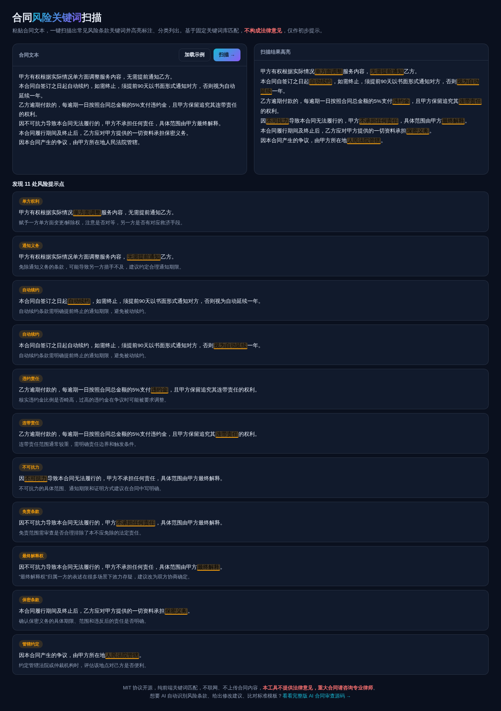

# 合同风险关键词扫描 · Contract Risk Scan

**[在线体验 →](https://anna123123123-creator.github.io/contract-scan/)**

免费开源、纯浏览器运行的合同风险关键词扫描工具。内置 13 类常见风险条款关键词库（单方权利、自动续约、违约责任、连带责任、免责条款、最终解释权、管辖约定等），粘贴合同文本一键扫描，高亮标注并分类列出提示说明。不联网、不上传合同内容。



**⚠️ 本工具基于固定关键词匹配，不构成法律意见，仅作初步提示，重大合同请咨询专业律师。**

## 试用方法

直接用浏览器打开 `index.html`，或用静态文件服务器跑起来：

```bash
python3 -m http.server 8000
```

## 内置关键词库覆盖

单方权利、通知义务、自动续约、违约责任、连带责任、免责条款、不可抗力、最终解释权、保密条款、管辖约定、定金条款、排他条款、知识产权，共 13 类，每类附一句提示说明。

## 实现原理

每类风险维护一条正则表达式，扫描合同全文，命中的位置高亮显示并提取所在句子作为上下文片段。纯规则匹配，`script.js` 里大概 130 行原生 JavaScript，没有接入任何 AI 模型——这也是为什么它**只能**做关键词提示，做不到真正的条款风险分析和修改建议。

## 协议

MIT。

## 需要定制版？

这个工具免费开源、可以直接用。如果你需要的是**改造成适合自己业务的版本**——换品牌、改字段、加功能、接后端或数据库——我可以做。

- **交付周期**：3–10 个工作日
- **交付内容**：完整源码（不加密、可自行二次开发）+ 在线地址 + 部署说明
- **已有 49 套现成系统**可直接改造，覆盖电商、教育、门店、内容、跨境等行业：[全部清单与在线演示](https://inzyxuashop.com)

把你的需求发给我，24 小时内回复可行性与报价：**evcdecd@gmail.com**
